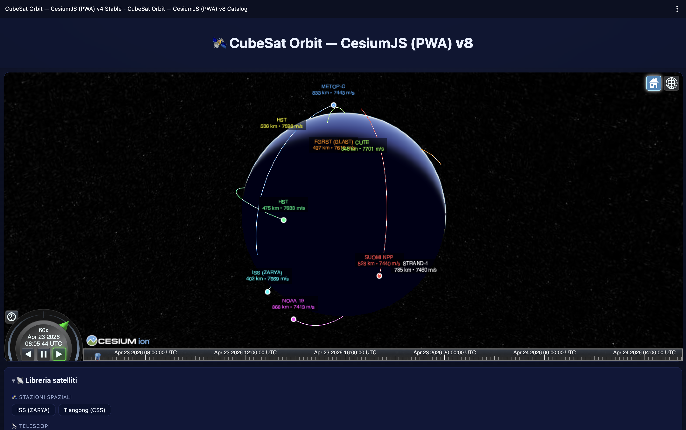

# 🛰️ CubeSat Constellation — CesiumJS TLE Viewer (PWA)



[🚀 Live Demo](https://pezzaliapp.github.io/CubeSat_Constellation) ·
[📡 Celestrak](https://celestrak.org) ·
[📜 MIT License](#-license)

> *"Osservare la Terra da lassù significa capire quanto sia fragile da quaggiù."*
> — Alessandro Pezzali

---

## 🇬🇧 English

**CubeSat Constellation** is an interactive Progressive Web App that visualizes satellite
orbits in real time on a 3D globe, using TLE (Two-Line Element) data and accurate SGP4/SDP4
propagation. Load a full constellation from the built-in live Celestrak catalog, or paste any
standard TLE block directly.

### Features

| Feature | Details |
|---|---|
| 🌍 Interactive 3D globe | CesiumJS + OpenStreetMap tiles, day/night shading |
| 🛰 Multi-satellite constellation | N satellites simultaneously, each with its own color and orbit |
| 📡 Live Celestrak catalog | 10 curated satellites across 4 categories, TLEs fetched fresh |
| 📊 Real-time telemetry | Altitude, velocity (from `prop.velocity`), real orbital period, lat/lon |
| ☀️ Sun tracking | Subsolar point, azimuth/elevation, dynamic day/night terminator |
| 🌑 Eclipse Tracker | Real-time shadow/light state per satellite with countdown to next transition |
| 🗺 Map links | Google Maps and OpenStreetMap centered on the satellite |
| 📲 Installable PWA | Works offline on desktop and mobile (iOS, Android, macOS, Windows) |

### Quick Start

```bash
git clone https://github.com/pezzaliapp/CubeSat_Constellation
cd CubeSat_Constellation
python3 -m http.server 8080
# Open http://localhost:8080
```

> **Note:** Serve via HTTP (not `file://`) to enable the Service Worker and offline mode.

### How to Use

1. Open the **📡 Satellite Library** panel and click any satellite to fetch its live TLE from Celestrak
2. Or paste one or more TLE blocks directly in the text field (Celestrak 2-line or 3-line format)
3. Click **▶️ Simula** — the satellite (or constellation) appears on the globe
4. Use **⏯️ Play/Pause** and **🔄 Reset** to control the simulation
5. Click **🗑 Cancella** to clear the TLE field and start a new constellation from scratch

### TLE Data Source

TLE data is fetched live from **[Celestrak](https://celestrak.org)** via their public GP endpoint:

```
https://celestrak.org/NORAD/elements/gp.php?CATNR={norad}&FORMAT=TLE
```

No registration or API key required.

### File Structure

```
/index.html          — HTML shell
/app.js              — Core logic: propagation, rendering, telemetry, catalog
/styles.css          — Dark space layout, mobile-safe
/manifest.json       — PWA manifest
/service-worker.js   — Offline cache (cache-first strategy)
/CHANGELOG.md        — Version history
/ANALISI_INIZIALE.md — Technical analysis and feature roadmap
```

---

## 🇮🇹 Italiano

**CubeSat Constellation** è una Progressive Web App interattiva che visualizza in tempo reale
le orbite di uno o più satelliti artificiali su un globo 3D, a partire dai dati TLE
(Two-Line Elements) con propagazione SGP4/SDP4 accurata. Puoi caricare una costellazione
intera dal catalogo integrato con TLE live da Celestrak, oppure incollare qualsiasi TLE standard.

### Caratteristiche principali

| Funzione | Dettaglio |
|---|---|
| 🌍 Globo 3D interattivo | CesiumJS + tile OpenStreetMap, ombreggiatura giorno/notte |
| 🛰 Multi-satellite | N satelliti simultanei, ognuno con colore e orbita propria |
| 📡 Libreria Celestrak live | 10 satelliti in 4 categorie, TLE aggiornati in tempo reale |
| 📊 Telemetria live | Altitudine, velocità (da `prop.velocity`), periodo orbitale reale, lat/lon |
| ☀️ Posizione del Sole | Punto subsolare, azimut/elevazione, terminatore giorno/notte |
| 🌑 Eclipse Tracker | Stato luce/ombra in tempo reale per ogni satellite con countdown alla prossima transizione |
| 🗺 Link mappa | Google Maps e OpenStreetMap centrati sul satellite |
| 📲 PWA installabile | Funziona offline su desktop e mobile |

### Avvio rapido

```bash
git clone https://github.com/pezzaliapp/CubeSat_Constellation
cd CubeSat_Constellation
python3 -m http.server 8080
# Apri http://localhost:8080
```

### Come si usa

1. Apri il pannello **📡 Libreria satelliti** e clicca un satellite per caricare il TLE live
2. Oppure incolla uno o più TLE nel campo di testo (formato Celestrak 2 o 3 righe per satellite)
3. Premi **▶️ Simula** — il satellite (o la costellazione) appare sul globo
4. Usa **⏯️ Play/Pause** e **🔄 Reset** per controllare la simulazione
5. Usa **🗑 Cancella** per svuotare il campo e costruire una nuova costellazione

---

## 🗺 Roadmap

Ideas sourced from the [initial technical analysis](ANALISI_INIZIALE.md).

| # | Feature | Status |
|---|---|---|
| 1 | Multi-satellite constellation mode | ✅ Done (v6) |
| 2 | Ground station + visibility cone + AOS/LOS | ✅ Done (v9) |
| 3 | Eclipse tracker — sunlit vs. shadow orbit coloring | ✅ Done (v10) |
| 4 | Doppler shift calculator for ham radio operators | ⏳ Planned |
| 5 | Pass predictor with .ics calendar export | ⏳ Planned |
| 6 | AR sky compass mode (mobile, DeviceOrientation API) | ⏳ Planned |
| 7 | Orbital decay & re-entry estimator (BSTAR drag term) | ⏳ Planned |
| 8 | Live Celestrak satellite catalog | ✅ Done (v8) |
| 9 | Communication coverage footprint (EllipseGraphics) | ⏳ Planned |
| 10 | Historical replay with annotated events timeline | ⏳ Planned |

---

## ⚠️ Known Limitations / Limitazioni note

**Geolocation (upcoming — Ground Station feature)**
The HTML5 Geolocation API (`navigator.geolocation`) requires a **secure context** (HTTPS or
`localhost`). It will not work if the app is opened directly via `file://`. When deployed on
GitHub Pages or any HTTPS host, it works correctly.

**Celestrak API rate limits**
The live TLE fetch uses Celestrak's public endpoint without authentication. For personal and
educational use this is fine. Heavy automated usage (many rapid fetches) may hit undocumented
rate limits. For production/high-traffic scenarios, cache TLEs locally or register for
[Space-Track](https://www.space-track.org/) direct access.

**PWA offline installation**
The Service Worker and "Add to Home Screen" prompt are only available when the app is served
over **HTTPS** on a public domain (or `localhost`). Opening `index.html` directly from disk
activates neither. GitHub Pages provides free HTTPS hosting and enables full PWA features.

---

## 🙏 Credits & Technologies

| Technology | Role | Link |
|---|---|---|
| **CesiumJS** | 3D globe, entity rendering, clock & timeline | [cesium.com](https://cesium.com/cesiumjs/) |
| **satellite.js** | SGP4/SDP4 orbital propagation from TLE | [github.com/shashwatak/satellite-js](https://github.com/shashwatak/satellite-js) |
| **Celestrak** | Public TLE data source (GP element sets) | [celestrak.org](https://celestrak.org) |
| **OpenStreetMap** | Map tiles for the globe base layer | [openstreetmap.org](https://www.openstreetmap.org) |

Map tiles © [OpenStreetMap contributors](https://www.openstreetmap.org/copyright) — ODbL license.

---

## 👨‍🚀 Author

**Alessandro Pezzali** — [pezzaliAPP.com](https://pezzaliapp.com)
Cultura digitale tra codice, orbite e immaginazione.

---

## 📜 License

MIT License — © 2025-2026 Alessandro Pezzali
Free to use for educational, scientific, creative and commercial purposes.
See [LICENSE](LICENSE) for the full text.
